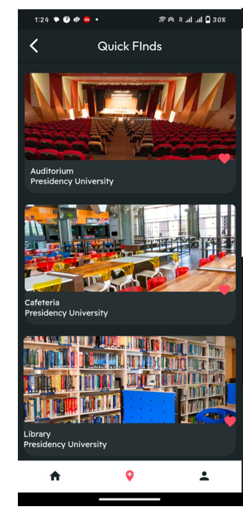

# Campus Explorer

**Campus Explorer** is a mobile application built using **Flutter SDK** and **Dart** to streamline navigation across university campuses. Developed as part of a Capstone Project at **Presidency University**, the app aims to enhance the campus experience for students, faculty, and visitors. It integrates real-time directions, voice guidance, and campus resource information into a single, easy-to-use platform.

---

## Table of Contents

- [Overview](#overview)
- [Features](#features)
- [Technologies Used](#technologies-used)
- [Screenshots](#screenshots)
- [Installation](#installation)
- [How to Use](#how-to-use)
- [Testing](#testing)
- [Team Members](#team-members)
- [Future Enhancements](#future-enhancements)
- [License](#license)

---

## Overview

Campus Explorer aims to simplify the navigation of large university campuses. The app provides the following features:

- **Real-time interactive maps**
- **Voice-guided directions**
- **Personalized recommendations**
- **Favorite locations and frequent spot tracking**
- **Secure login and user profiles**

The application is designed to assist new students and individuals with disabilities in navigating their campus by providing an intuitive and accessible solution to campus navigation challenges.

---

## Features

- **Interactive Maps:** Users can zoom, pan, and explore buildings and landmarks within the campus with ease.
- **Smart Navigation:** The app offers turn-by-turn directions with real-time GPS tracking to guide users to their destinations.
- **Voice Assistance:** Hands-free, voice-guided navigation ensures improved accessibility for all users.
- **Profile Customization:** Users can save their favorite places and personalize their app experience.
- **Campus Resources:** The app integrates campus events, departments, and amenities, allowing users to view important information in one place.
- **Secure Login:** User data is protected through authentication and encryption measures.

---

## Technologies Used

- **Flutter SDK:** Framework for cross-platform app development
- **Dart:** Primary programming language for app development
- **Google Maps API:** Provides real-time location services and map functionalities
- **Java:** Used for backend services
- **Firebase:** Handles user authentication and real-time database functionalities
- **Flutter DevTools:** Tools for debugging and performance optimization

---

## Screenshots

### Landing Page

### Login Page

### Home Page

### Map Interface

### Profile Creation

### Profile Section

### Settings Page

### Quick Finds

### Select Location

---

## Installation

Follow these steps to install and run the app on your local machine:

1. **Clone the repository:**
   ```bash
   git clone https://github.com/karishmadanish/campus-explorer.git
   cd campus-explorer
   ```

2. **Install dependencies:**
   ```bash
   flutter pub get
   ```

3. **Run the app:**
   ```bash
   flutter run
   ```

> **Note:** The app is currently available for Android only.

---

## How to Use

1. Open the app on your Android device.
2. Sign in using your credentials.
3. Use the search feature or the map interface to find locations on campus.
4. Enable voice guidance if preferred.
5. Save your favorite locations or track frequently visited areas.

---

## Testing

- **Unit Testing:** Core logic and functions validated using Dart's testing framework.
- **UI/Functionality Testing:** Verified responsive layout and navigational flow.
- **Integration Testing:** Ensured smooth interaction between location tracking and API services.
- **User Acceptance Testing:** Feedback from real users was incorporated into the design and development.

---

## Team Members

- **Megha Saha**   
- **Abhijit Deb** 
- **Karishma Danish** 

**Guided by:**
- Ms. Mary Divya Shamili D – Assistant Professor  
- Dr. Sampath A. K. – Project Mentor

---

## Future Enhancements

- Augmented Reality (AR) navigation
- Indoor positioning system (IPS) integration
- Biometric/multi-factor authentication
- Expanded university and public area support
- Integration with dining services, event platforms, and shuttle tracking

---

## License

This project is for academic purposes under [Presidency University]. Licensing terms can be added here if open-sourcing in the future.

---

